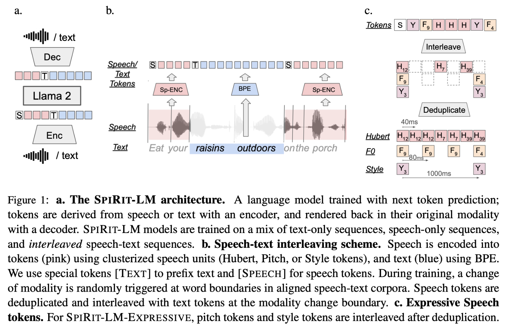

# Spirit-LM: Interleaved Spoken and Written Language Model

This repository contains the model weights, code and evaluation scripts for the Spirit-LM [paper](https://arxiv.org/pdf/2402.05755.pdf). You can find more generation samples on our [demo page](https://speechbot.github.io/spiritlm/).
## Spirit-LM Model Overview


## Installation Setup
### Conda
```
conda env create -f env.yml

(Optionally, use only if you want to run the tests.)
pip install -r requirement.dev.txt
```
### Pip
```
pip install -e .
```

## Quick Start
### Speech Tokenization
See [spiritlm/speech_tokenizer/README.md](spiritlm/speech_tokenizer/README.md)
### Spirit-LM Generation
See [spiritlm/model/README.md](spiritlm/model/README.md)
### Speech-Text Sentiment Preservation benchmark (STSP)

## Checkpoints Setup
See [checkpoints/README.md](checkpoints/README.md)

## Licence
TODO
## Citation
TODO

